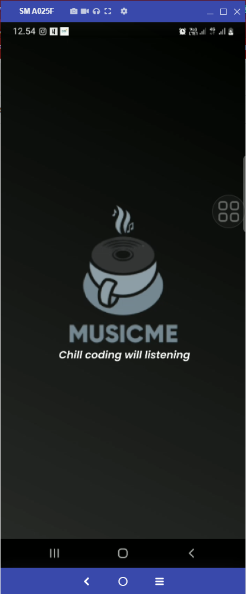
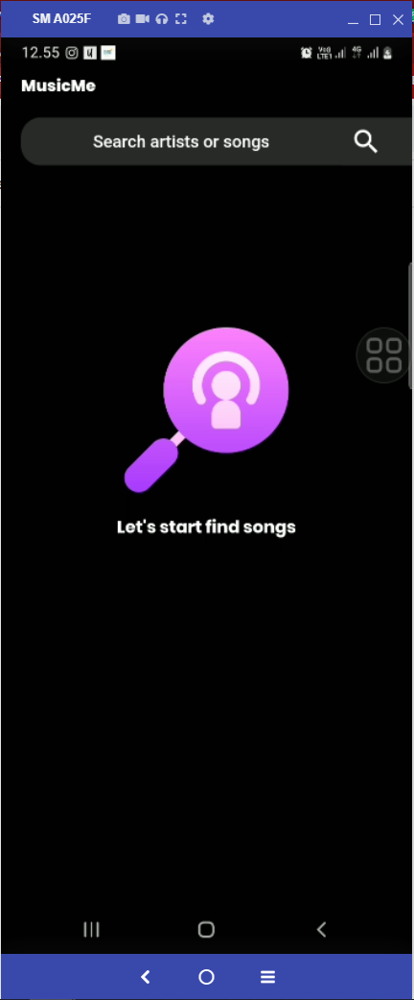
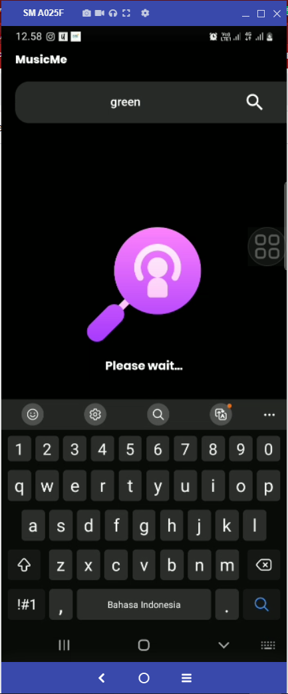
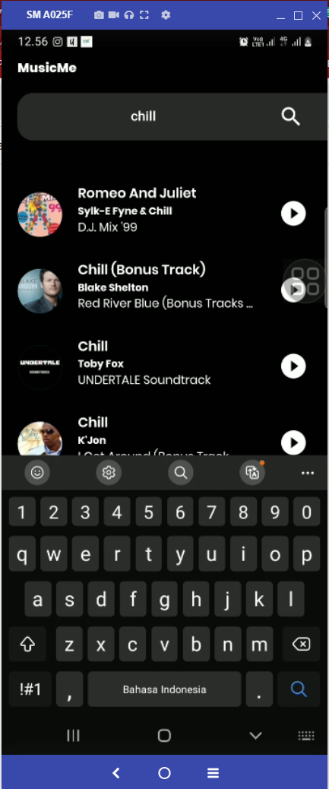
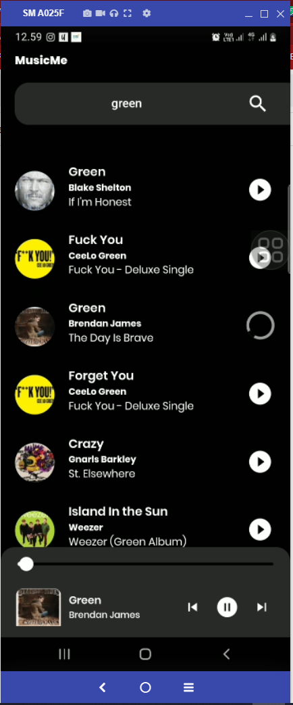

# MusicMe

Simple music player using flutter, Music from Itunes.

    

## Features

1. Will code search your favourite artist/song in iTunes!, play & enjoy!
2. Pause, prev, next & seek on duration of your song.
3. Search other song while still listening to the current song or just push button next or prev (vice verca) to play song from the list.
4. Error handling api, empty search and many more.

## Link Download build .apk

- [Gdrive](https://drive.google.com/drive/folders/1GDyKWi5HYKpWxIc0qzZpzV_lndV4Cxec?usp=sharing)

## Develop or build App requirements

- Graddle version gradle-6.7-all.zip
- installed Android studio and Flutter
- Flutter v3.3.0 on channel stable
- Dart verrsion v2.18.0
- Simulator or Android device minSdk 23 [marshmallow](https://androidsdkoffline.blogspot.com/p/android-sdk-60-api-23-marshmallow.html) you can just download it from your android studio.

## Supported Device

-Simulator or Android device minSdk 23 [marshmallow]
-Ios OS IPhone 9.0

## Instruction Deploy in your local environment

1. Clone from this repository by download zip or https or ssh (recommended using https or ssh)
   - Copy repository url
   - Open your fav code editor _(Recommended using Android Studio or Visual Studio Code)_
   - _(Android Studio)_ New -> Project from Version Control.. -> Paste the url, click OK
   - _(Visual Studio Code)_ create folder where do you want, open terminal and paste url clone then enter -> open root folder.
2. Run "flutter pub get" in the project directory or click the highlighted instruction in Android Studio or Visual Studio Code
3. Prepare the Android Virtual Device or real device _(Make sure its supported device)_
4. Run main.dart

## Project Code Infrastructure & Design Pattern

This App project directory consist of 4 directories (Preparation for preparation for the next possible complex feature & scallable code)

### Design pattern or state management used

- State Management [BLOC](https://bloclibrary.dev/#/)
- Design Patter [RepositoryPattern](https://blog.logrocket.com/implementing-repository-pattern-flutter/#:~:text=Flutter%20developers%20use%20various%20design,widgets%20into%20private%20methods%2Fclasses.)

### Folder Structure & Description

1. **presentations**: _Inside lib folder consists folder presentation which is folder for mainly structured view or presentation to users_
   - `router folder`: _folder for declare onGenerateRoute which more scalable route for wide complex project, define class screen in switch case and call it directly to its named route class_
     > `app_router.dart` : file class ongenerated route which is called in main.dart to initialize route page for first launching App route begin by '/' where it is splashscreen.
   - `screens folder`: _folder for main page statefull widget of each feature in app_
     > `home_screen.dart` : file class main page for homepage the main feature search and listen music.
     > `home_screen.dart` : file class splash screen for initialize page of app and support for first implementation to check wheter the user authorized or not by the api services.
   - `widgets folder`: _consists widgets that build the main screen (homepage) and do it's function and its reusable_
     > `appbar_search.dart` : widget that provide the search abstract component for main homepage do search songs and build in stateless widget and reusable.
     > `bottol_player.dart` : widget that provide the player controller, which are play/pause, prev, next button, seek bar title, artistName, and image of album of course.
     > `list_music_data.dart` : widget ListTile that provide list of the songs after processing query.
     > `widget_state_handling.dart` : widget that provide view where handling status from bloc state (Initial, loading, error) and can customized image & description and its reusable too.
2. **logic** : _Inside lib folder consists folder logic which is folder for handle complex logic for the main page of the feature_
   - `cubit`: _folder for bloc statemanagement and business logic where made_
     > `music_data_cubit.dart` : cubit class for main function logic proccessing the request to api_service in repository and return emit state form music_data_state.dart where it can be customized by response status and message from server (complex apps in big company really helped with this feature state management).
     > `music_data_state.dart` : cubit state class where we can define inherited class state. here we can create state by look at api_service response status or message.
     > `music_player_cubit.dart` : cubit class for controlling start play function in AudioPlayer library and send state data to bottom_player.dart to show attribut from the songs.
     > `music_player_state.dart` : cubit state class where we can define inherited class state after success execution audioplayer.
   - `function`: _empty folder for now but very useful in the future to accommodate Class helper functions that help reduce spaghetti code functions on the main view screen page where project is getting more complex_
3. **constant** : _folder for files provide constants value file to the project example: api constant, colors, class abstract, device service value bluetooth , camera etc_
   > `api_response.dart` : abstract class api response to simpler make state response from api_services executed in 'respository->api->home_api.dart'
   > `api.dart` : its constant file that had some interact as .env (environtment controller) in here im declare the url main for production and dev which is can make we developer easier to control where should the api_services hit the root url, and because this file it can be so helped to developer when want to change the root url hit by api_services, just change APP_ENV to "PROD" or "DEV".
4. **repository** : _folder for interface api, api class function, and model interface_

- `api`: _folder for declare api services that used for feature in app_
  > `base_api.dart` : its file define the base function for api_services which is GET, POST, POSTPARSE, GETPARSE and etc. And the main focus for this base api its to manage the bearer_token for auth app.
  > `home_api.dart` : its file define the api_services for api function in main homepage search query and this class can include many different api service which is in complex app will be had 1 to multiple endpoint for just 1 page.
- `model`: _folder for declare model interface object that had received from apiservices where its processed by cubit in bloc state management that used for feature in app_
  > `music_data_response_model.dart` : interface model for musicdata that had been received from api service response and include response status, message, and data.
